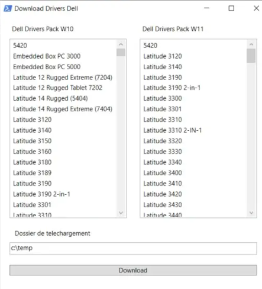

# Dell Drivers GUI Downloader



This PowerShell script provides a **graphical interface (WPF/XAML)** to download Dell driver packs.  
It parses the official Dell **DriverPackCatalog** and allows selection by model and OS.

## ✨ Features
- GUI with two lists: Dell models for **Windows 10** and **Windows 11**  
- Select one or multiple models and download drivers  
- Uses `7-Zip` for extraction  
- Logs actions into a `.log` file for troubleshooting  

## 📌 Requirements
- Windows with PowerShell (STA mode)  
- .NET Framework (for WPF/XAML support)  
- 7-Zip installed at `C:\Program Files\7-Zip\7z.exe`

## 🚀 Usage
1. Run the script in **PowerShell STA mode**:
   ```powershell
   powershell -sta -File .\DownloadDriversGUI.ps1
   ```
2. Choose the target models and OS (Win10/Win11).

3. Specify the download folder.

4. Click Download to fetch and extract driver packs.