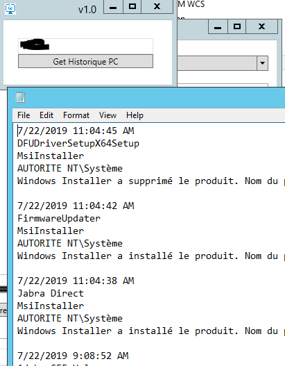

# PC Reliability History – PowerShell GUI



A lightweight **PowerShell + WPF** tool to view the **Windows Reliability History** of a local or remote computer.

## ✨ Features
- Simple GUI with a field for **computer name**  
- Button to retrieve history via **WMI (Win32_ReliabilityRecords)**  
- Results displayed with date, product, and source  
- Error handling for connection issues or missing history  

## 📌 Requirements
- Windows with PowerShell in **STA mode** (`powershell -sta`)  
- WMI access rights on the target machine  

## 🚀 Usage
1. Run the script in PowerShell STA mode:
   ```powershell
   powershell -sta -File .\PC-ReliabilityHistory.ps1
   ```
2. Enter the computer name.

3. Click Get History to display events from the Reliability History.